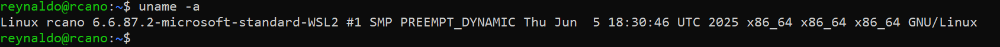
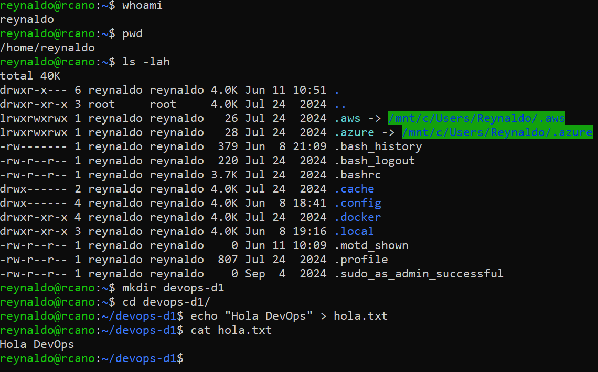
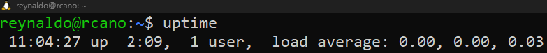
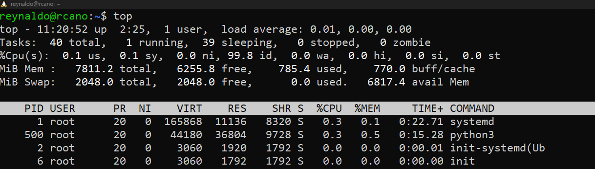
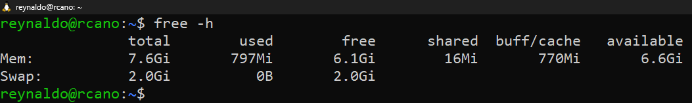

# Day 01

## ¿Qué significa DevOps para mí?

Es una metodología que une a equipos diferentes y tradicionalmente separados para un bien común, el de ofrecer un software más seguro, entregas más rápidas y procesos automatizados. Antes eran como islas separadas, ahora trabajan en equipo de forma continua.

## ¿Qué herramientas conocía?
Solamente **Docker**, ya he hecho algunos contenedores sencillos, he escuchado sobre **Kubernetes**, pero nunca trabajé ni hice nada con esa herramienta. Nunca había escuchado sobre **Terraform**, **Ansible** y **Jenkins**. Pero estoy entusiasmado por usarlas.

## Primeros pasos en Linux

### Comando uname
```bash
uname -a
```


### Otros Comandos
```bash
whoami
pwd
ls -lah
mkdir devops-d1
cd devops-d1
echo "Hola DevOps" > hola.txt
cat hola.txt
```


## Desafío Linux

* ¿Cuánto tiempo lleva encendido tu sistema?
```bash
uptime
```


Según el comando, el sistema tiene 2hrs con 9min encendido

* ¿Qué procesos están consumiendo más recursos?
```bash
top
```


* ¿Cuánta memoria disponible tenés?
```bash
free -h
```
