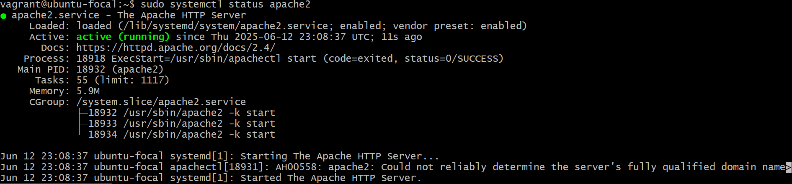
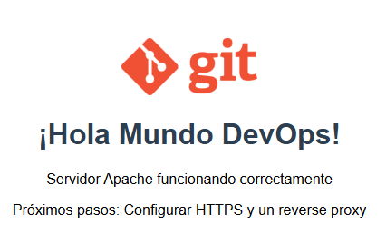

# Desplegar un "Hola Mundo" desde Apache

## Actualizar sistema
Antes de nada, debemos de actualizar el sistema
```bash
    sudo apt update && sudo apt upgrade -y
```

## Instalar apache
```bash
    sudo apt install apache2 -y
```

## Verificar status
```bash
    sudo systemctl status apache2
```


## Crear página web
```bash
    sudo nano index.html
```
```html
<!DOCTYPE html>
<html lang="es">
    <head>
        <meta charset="UTF-8">
        <title>¡DevOps en Acción!</title>
        <style>
            body { font-family: Arial, sans-serif; text-align: center; margin-top: 50px; }
            h1 { color: #2c3e50; }
            .logo { width: 150px; }
        </style>
    </head>
    <body>
        
        <h1>¡Hola Mundo DevOps!</h1>
        <p>Servidor Apache funcionando correctamente</p>
        <p>🛠️ Próximos pasos: Configurar HTTPS y un reverse proxy</p>
    </body>
</html>
```
## Visualizar en el navegador
Desde el navegador accedemos a http://localhost:8080

