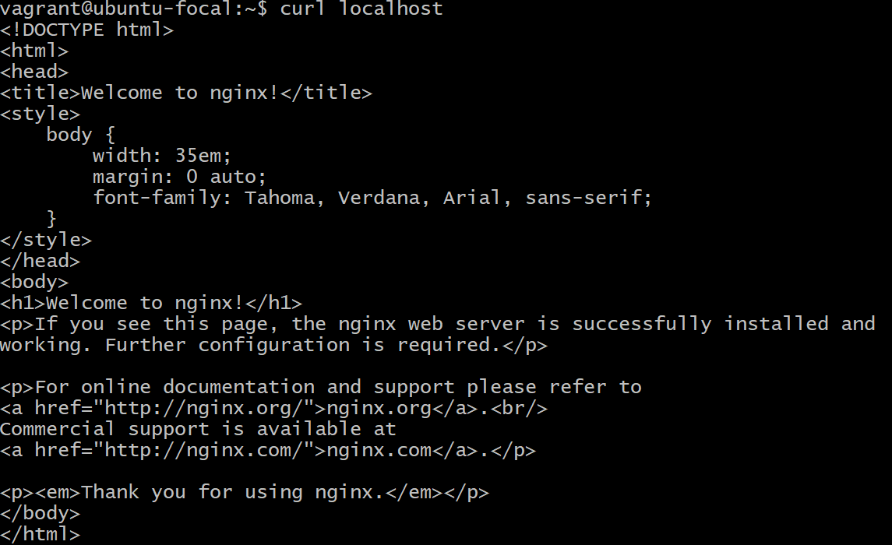
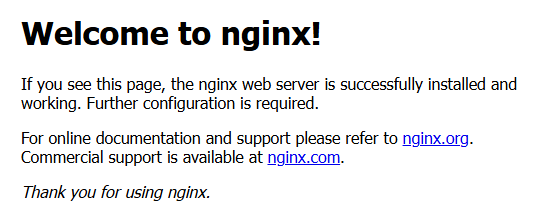

## Instalar Nginx
Usando una máquina virtual levantada con Vagrant,
cuando ingresamos con vagrant ssh, procedemos a instalar nginx,
con los siguientes comandos

```bash
  sudo apt install nginx
```

```bash
  sudo systemctl start nginx  
```
Ya esto deberá bastar para tener corriendo nginx, pero debemos de probarlo

```bash
    curl localhost 
```
Si se ha instalado e iniciado correctamente, deberíamos de ver algo similar a la imagen de abajo


Desde el navegador podremos ver


