# Aprendiendo Git
Veremos algunos de los comandos más comunes y esenciales a la hora de trabajar con Git.

## Instalación
Desde la web: https://git-scm.com/downloads, elegimos el sistema operativo de nuestra PC.  


Verificamos si se ha instalado correctamente con el comando:
```bash
    git --version
```

Nos debería mostrar algo parecido a la imagen de abajo:  
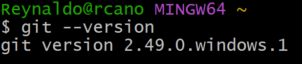

## Crear primer repo
Creamos una carpeta donde estará nuestro repositorio. Luego, con el comando `git init`, inicializamos un repositorio vacío.  
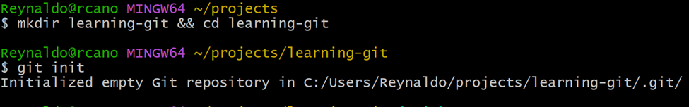

## Agregar archivos
Creamos dos archivos que posteriormente vamos a integrar a Git.  
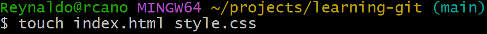

Con el comando `git status`, podemos ver los archivos rastreados por Git, los que han sido modificados y los que no están siendo rastreados.  
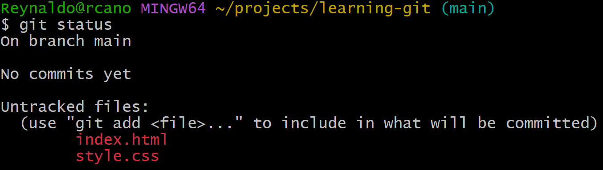

Aún no hemos agregado estos archivos a Git; Git no los "rastrea". Necesitamos hacer que Git pueda rastrearlos, con el comando `git add file`.  
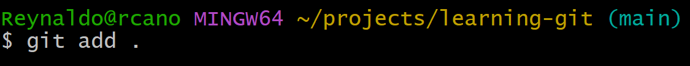  
En este caso hicimos `git add .` para agregar todos los archivos.

## Primer commit
Los commits son toda la historia de nuestro código. Cada cambio que se hace se registra por medio de commits. De esta manera, podemos ver cómo un archivo ha sido modificado a lo largo del tiempo.  
Empleamos el comando:
```bash
git commit -m "Mensaje de commit"
```  
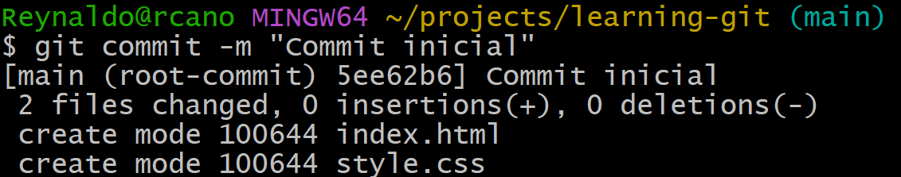

## Realizar cambios
Siempre que modificamos un archivo y queremos guardar el cambio, tenemos que hacer un `git add`, luego un `git commit`.  
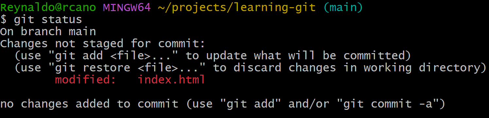

Podemos ver las diferencias del archivo entre nuestro cambio actual y el cambio que está en el último commit. Para eso usamos el comando `git diff`.  
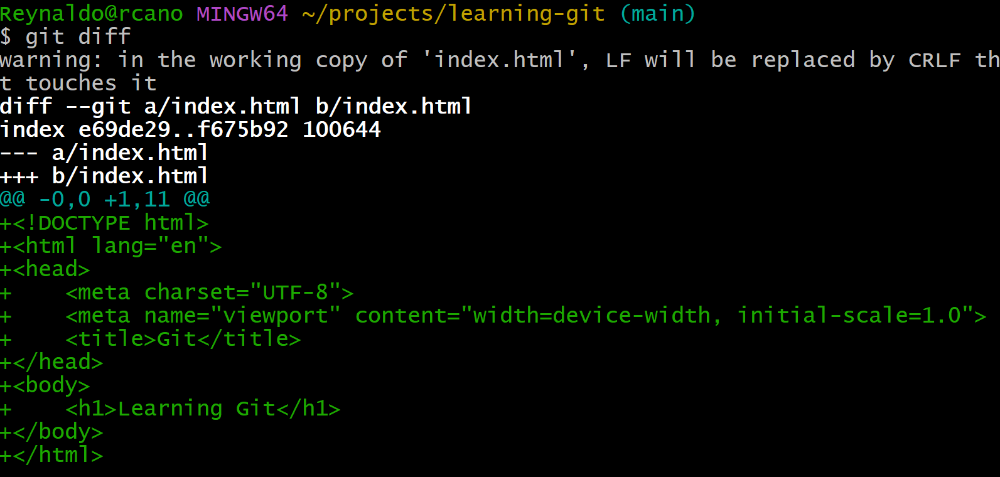

## Ver historial
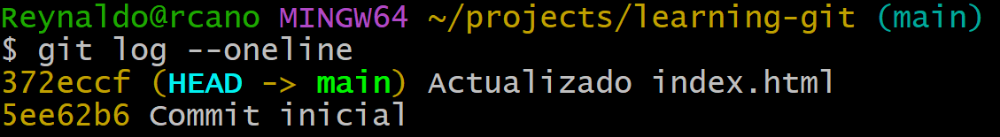

## Conectar a GitHub
El repositorio que hemos creado está local. Ahora debemos crear un repositorio en GitHub para poder subir todos nuestros cambios allí.

Una vez creado el repositorio en GitHub, debemos indicar desde nuestra terminal cuál es el `origin`, es decir, el repositorio remoto.

Para eso usamos el comando:
```bash
git remote add origin https://github.com/usuario/repo.git
```  
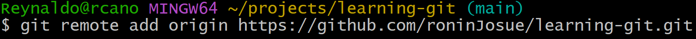

Como ya tenemos la rama `main` creada, necesitamos subir los cambios de `main` al `origin` con el comando:
```bash
git push -u origin main
```  
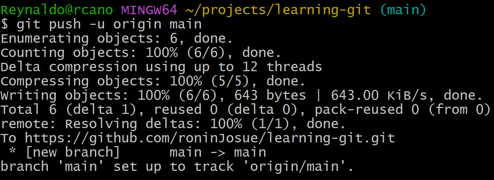

Esto va a crear una rama `main` en el `origin`, y ya tendremos una conexión entre las dos ramas: la local y la remota.
