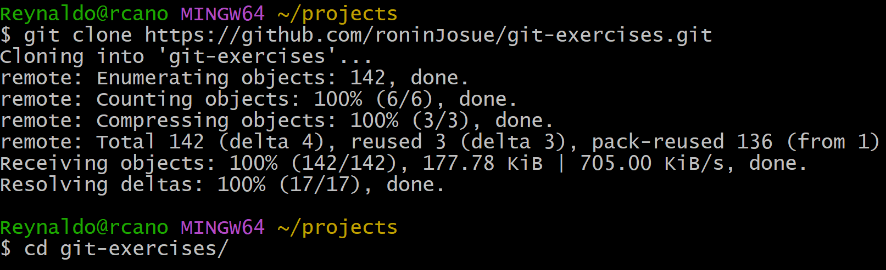
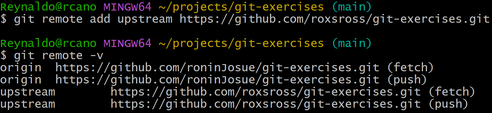
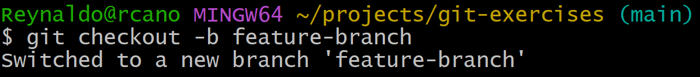
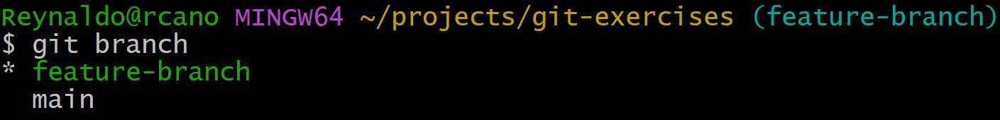
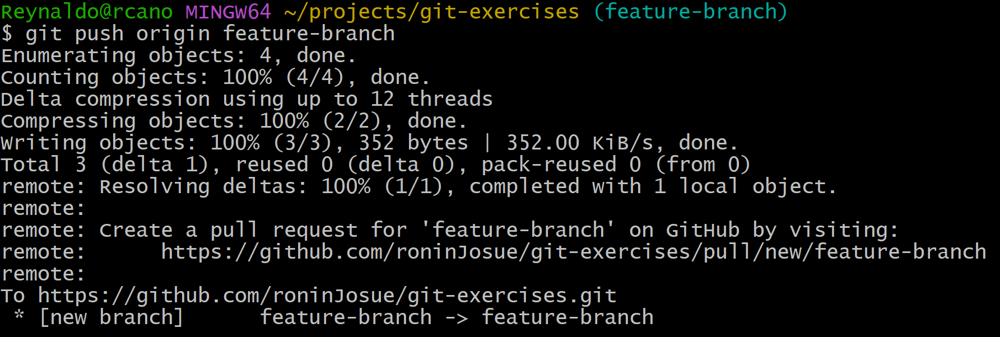
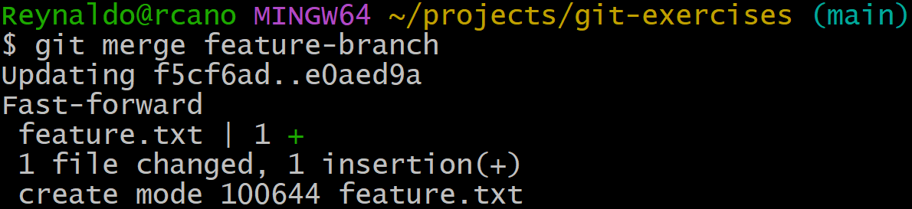
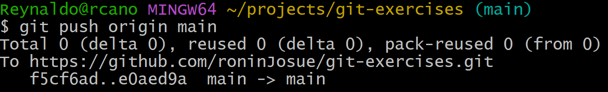
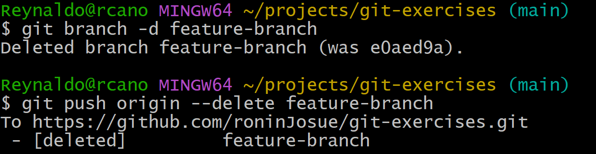
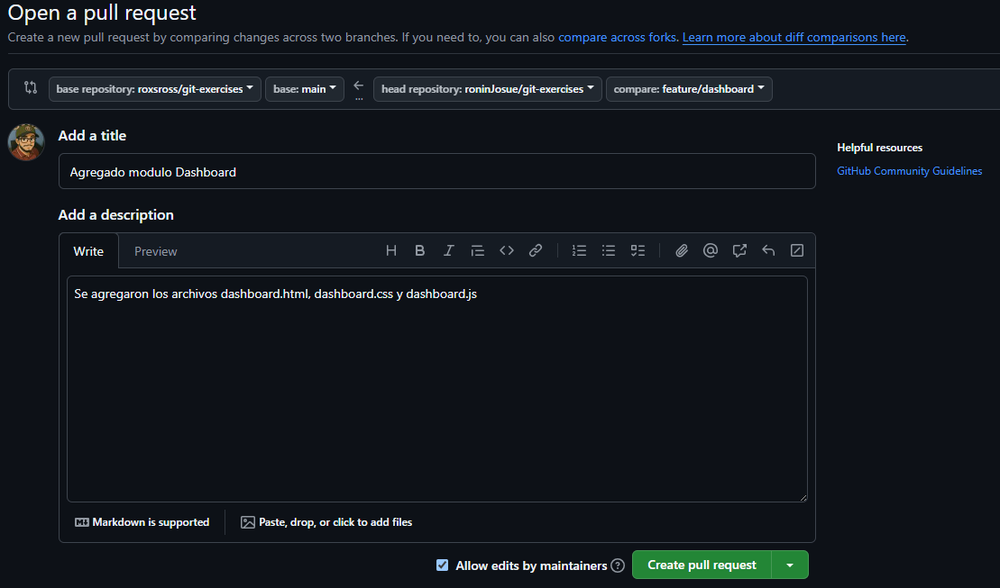
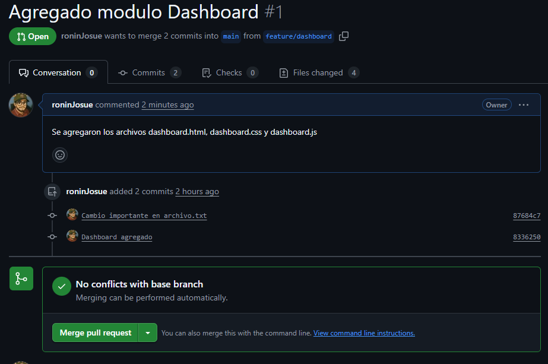

# Desafío 1: fork y clone
Un fork nos permite crear una copia de un repositorio en nuestra propia cuenta de GitHub. Esta copia es completamente independiente del repositorio original, pero mantiene una conexión que nos permite enviar cambios si así lo deseamos.

Una vez hecho el fork, podemos clonar el repositorio a nuestra máquina local para trabajar en él.
Esto nos permite colaborar en proyectos de otros desarrolladores realizando cambios en nuestra copia y luego proponiendo mejoras al repositorio original mediante un pull request.

Desde mi cuenta de GitHub ya hice fork al repositorio: [Git Exercises by RoxRoss](https://github.com/roxsross/git-exercises), ahora desde mi local lo clono

Con esto tengo una copia local para poder trabajar mis cambios acá.

Es posible agregar otro repositorio remoto con el comando git remote add "nombre-repo-remoto" url-repo-remoto. Esto nos permite poder traernos los últimos cambios del repositorio origina, y asi poder tener lo más actualizado nuestro fork para poder subir nuestros propios cambios.


# Desafío 2: Branching
Las ramas son una herramienta fundamental en Git que nos permite trabajar de forma paralela y organizada. Gracias a ellas, podemos desarrollar nuevas funcionalidades (features), corregir errores (bugs), o experimentar con cambios sin afectar directamente la rama principal del proyecto.

Cada rama representa una línea de trabajo independiente, y una vez que los cambios están listos, se pueden integrar (mediante un merge o pull request) a la rama principal, generalmente llamada main o master.

Para crear una rama y cambiarnos a ella, usamos el comando git checkout -b nombre-rama


Para ver un listado de las ramas disponibles, y en la que estamos posicionados usamos el comando git branch

Vamos a empezar a agregar la nueva funcionalidad, para ello creamos un archivo llamado feature.txt, lo agregamos al área staged para poder hacer un commit. Una vez hecho esto enviamos la nueva rama al origin, es decir, al repo remoto, esto crea una nueva rama llamada feature-branch en nuestro repo remoto.


# Desafío 3: Merging
Cuando ya hemos terminado nuestra nueva feature, lo que hay que hacer es integrarla a la rama principal, en este caso main, esto para que main tenga todos los cambios hechos en feature-branch. Empleamos el comando git merge rama-a-unir, pero antes nos posicionamos en la rama a la cual vamos a integrar los cambios.

Subimos los cambios a la rama main remota, con git push origin main

Lo recomendable en este punto es eliminar la rama en la que creamos la nueva feature. También eliminamos la rama remota


# Desafío 4: Deshacer Commits

## Git Reset
He creado 3 commits para demostrar el uso de **git reset**, actualmente el historial esta así:
```bash
$ git log --oneline
da7e121 (HEAD -> main) Commit 3
3ce8f67 Commit 2
1e66aa4 Commit 1
```
Esos son los últimos 3 commits, vamos a ver las diferentes opciones que tiene el comando git reset
### git reset --soft
Vamos a ejecutar el siguiente comando para eliminar el último commit, el que tiene el mensaje: "Commit 3"

```bash
    git reset --soft HEAD~1
```

Lo que ocurre aca, es que el último commit, que es donde apuntaba el puntero HEAD, ha sido eliminado, pero aún se mantienen los cambios en el staging área

```bash
  $ git log --oneline
  3ce8f67 (HEAD -> main) Commit 2
  1e66aa4 Commit 1
  e0aed9a (origin/main, origin/HEAD) Agregado feature.txt con nueva funcionalidad
```

```bash
  $ git status
  On branch main
  Your branch is ahead of 'origin/main' by 2 commits.
    (use "git push" to publish your local commits)

  Changes to be committed:
    (use "git restore --staged <file>..." to unstage)
      modified:   archivo.txt
```
En efecto, ha desaparecido el commit antes mencionado, pero nuestros cambios aún permanecen en el staging, lo que podemos hacer es hacer un commit nuevamente.

### git reset --mixed
Si no se le pasa la opción, por defecto siempre es **--mixed**

```bash
    git reset --mixed HEAD~1
```
Nuevamente, vamos a eliminar el último commit, la funcionalidad con esta opción es diferente:

```bash
    $ git status
    On branch main
    Your branch is ahead of 'origin/main' by 2 commits.
      (use "git push" to publish your local commits)
    
    Changes not staged for commit:
      (use "git add <file>..." to update what will be committed)
      (use "git restore <file>..." to discard changes in working directory)
            modified:   archivo.txt
    
    no changes added to commit (use "git add" and/or "git commit -a")
```
```bash
    $ git log --oneline
    3ce8f67 (HEAD -> main) Commit 2
    1e66aa4 Commit 1
    e0aed9a (origin/main, origin/HEAD) Agregado feature.txt con nueva funcionalidad
```
1. Se elimino el ultimo commit
2. Se eliminó del staging área los cambios, ahora están en el working directory
3. El archivo aún mantiene la misma información

### git reset --hard
Esta es la opción más peligrosa, ahora veremos el porqué

```bash
    git reset --hard HEAD~1
    HEAD is now at 3ce8f67 Commit 2
```
```bash
    $ git log --oneline
    3ce8f67 (HEAD -> main) Commit 2
    1e66aa4 Commit 1
    e0aed9a (origin/main, origin/HEAD) Agregado feature.txt con nueva funcionalidad
```

1. Nuevamente se elimino el ultimo commit
2. No hay cambios en el staging area
3. No hay cambios en el working directory
4. El contenido del archivo cambio

## Git revert
Al contrario de git reset, git revert no elimina el historial, si no que agrega un nuevo commit deshaciendo lo que hizo el commit "revertido".
Veamos el hash del ultimo commit.
```bash
  $ git log --oneline
  41e70a5 (HEAD -> main) Commit 3
  3ce8f67 Commit 2
  1e66aa4 Commit 1
  e0aed9a (origin/main, origin/HEAD) Agregado feature.txt con nueva funcionalidad
```

Vamos a revertir el commit 41e70a5.
```bash
    $ git revert 41e70a5
```

Al hacer esto, se nos abre un editor de texto para agregar el mensaje del commit de reversion.

```bash
    [main d73c287] Revert "Commit 3"
    1 file changed, 1 deletion(-)
```
```bash
  $ git log --oneline
  d73c287 (HEAD -> main) Revert "Commit 3"
  41e70a5 Commit 3
  3ce8f67 Commit 2
  1e66aa4 Commit 1
```
```bash
  $ cat archivo.txt
  Línea 1
  Línea 2
```
Como podemos ver, el commit no se ha eliminado, lo que ha pasado es que se crea un nuevo commit, deshaciendo los cambios que estaban presentes en el commit seleccionado.

# Desafío 5: Rebase
Al hacer un rebase a una rama, estamos garantizando tener un historial más limpio y lineal, útil para evitar los commits de merge, que no tienen ninguna utilidad nada más para mostrar que en ese punto hubo un merge.
Cuando estamos trabajando en una rama feature, y vamos haciendo commits, pero a su vez la rama main va agregando más commits, es de utilidad hacer un rebase main, para que nuestra rama salga desde el último commit de main, de esta manera estamos agregando los nuevos commits de main a nuestra rama, sin tener que hacer merge.
Esto solo se debe de hacer en ramas locales y que no sean públicas.

Desde la rama main, voy a crearme dos ramas **feature/dashboard** y **hotfix/login**.

```bash
    $ git checkout -b feature/dashboard
    Switched to a new branch 'feature/dashboard'
```
```bash
    $ git checkout -b hotfix/login
    Switched to a new branch 'hotfix/login'
```

Ambas ramas parten de main. Ahora supongamos que se está trabajando en la rama feature/dashboard, se crean archivos para esa funcionalidad.
```bash
  $ echo "<h1>Dashboard</h1>" > dashboard.html
```
```bash
  $ echo "console.log('Dashboard')" > dashboard.js
```
```bash
  $ echo "{color: red}" > dashboard.css
```
```bash
    $ git status
    On branch feature/dashboard
    Untracked files:
      (use "git add <file>..." to include in what will be committed)
            dashboard.css
            dashboard.html
            dashboard.js
```
Agregamos al staged y hacemos commit de esos cambios
```bash
    $ git commit -m "Dashboard agregado"
    [feature/dashboard e8d8fc4] Dashboard agregado
     3 files changed, 3 insertions(+)
     create mode 100644 dashboard.css
     create mode 100644 dashboard.html
     create mode 100644 dashboard.js
```
En la rama main hemos hecho algunos cambios a archivos, esos cambios tienen que estar integrados a la rama feature/dashboard, podemos hacer esto con un merge, pero eso genera commits adicionales al historial, aca usamos rebase.
Nos situamos en la rama feature/dashboard, y hacemos rebase de main.

Hay que tener en cuenta que los commits nuevos en esta rama, son reescritos, y los pone por delante del último commit de main.
```bash
    $ git switch feature/dashboard
    Switched to branch 'feature/dashboard'
```
```bash
    $ git log --oneline
    e8d8fc4 (HEAD -> feature/dashboard) Dashboard agregado
```
Ese es el commit que va a ser reescrito.
```bash
    $ git rebase main
    Successfully rebased and updated refs/heads/feature/dashboard.
```
```bash
    $ git log --oneline
    8336250 (HEAD -> feature/dashboard) Dashboard agregado
    87684c7 (main) Cambio importante en archivo.txt
```
Vemos que ahora los commits que solo existen en la rama feature/dashboard, empiezan desde el último commit de la rama main.
Se ha integrado sin hacer un merge commit, manteniendo el historial lineal y limpio, hay que tener en cuenta que todos los commits que se han reescrito, se pierde el momento exacto cuando fueron creados.

# Desafío 5: Pull Request
Primero tenemos que enviar todos nuestros cambios de la rama feature/dashboard al repositorio remoto, con git push
```bash
    $ git push origin feature/dashboard
    Enumerating objects: 10, done.
    Counting objects: 100% (10/10), done.
    Delta compression using up to 12 threads
    Compressing objects: 100% (5/5), done.
    Writing objects: 100% (8/8), 754 bytes | 754.00 KiB/s, done.
    Total 8 (delta 2), reused 0 (delta 0), pack-reused 0 (from 0)
    remote: Resolving deltas: 100% (2/2), completed with 1 local object.
    remote:
    remote: Create a pull request for 'feature/dashboard' on GitHub by visiting:
    remote:      https://github.com/roninJosue/git-exercises/pull/new/feature/dashboard
    remote:
    To https://github.com/roninJosue/git-exercises.git
     * [new branch]      feature/dashboard -> feature/dashboard
```
Esto crea una nueva rama en GitHub llamada feature/dashboard, ahora podemos hacer un pull request.



Si no hay conflictos se aprueba y hace el merge.



# Desafío 7: Resolución de Conflictos
Los conflictos son recurrentes al momento de trabajar de forma colaborativa, cuando dos o más desarrolladores modifican un mismo archivo, y al hacer un merge, no se puede realizar automáticamente, sino manual.

Nos vamos a crear un nuevo repositorio para demostrarlo.

```bash
    $ git init conflict-demo
    Initialized empty Git repository in C:/projects/conflict-demo/.git/
```
```bash
  $ cd conflict-demo/
```
Agregamos archivos
```bash
  $ echo "Hola, DevOps!" > archivo.txt
```
```bash
  $ git add archivo.txt
```
```bash
    $ git commit -m "Commit inicial"
    [main (root-commit) 26d0266] Commit inicial
     1 file changed, 1 insertion(+)
     create mode 100644 archivo.txt
```
Ahora creamos otra rama.
```bash
    $ git checkout -b feature-branch
    Switched to a new branch 'feature-branch'
```
Modificamos archivo.txt
```bash
  $ echo "Cambio en feature branch" > archivo.txt
```
```bash
  $ git add archivo.txt
```
```bash
    $ git commit -m "Modificado archivo.txt en feature-branch"
    [feature-branch a3d4a89] Modificado archivo.txt en feature-branch
     1 file changed, 1 insertion(+), 1 deletion(-)
```
Ahora vamos de vuelta a main, para realizar un cambio en el mismo archivo.
```bash
  $ echo "Cambio en main branch" > archivo.txt
  $ git add archivo.txt
  $ git commit -m "Modificado archivo.txt en main"
  [main c02129f] Modificado archivo.txt en main
  1 file changed, 1 insertion(+), 1 deletion(-)
```
Ahora si queremos hacer un merge de feature-branch nos saldrá un conflicto, que debemos de corregir manual.

```bash
    $ git merge feature-branch
    Auto-merging archivo.txt
    CONFLICT (content): Merge conflict in archivo.txt
    Automatic merge failed; fix conflicts and then commit the result.
    
    Usuario@username MINGW64 ~/projects/conflict-demo (main|MERGING)
```
Ups, no hemos podido hacer el merge, que ha pasado, pues como en ambas ramas se modificó el mismo archivo, git no puede unirlos automáticamente.
Abrimos el archivo con algún editor de texto, como vscode, para arreglar el conflicto. Vemos que el archivo tiene ese contenido.
```bash
    <<<<<<< HEAD
    Cambio en main branch
    =======
    Cambio en feature branch
    >>>>>>> feature-branch
```
Se muestran los cambios de las dos ramas, tenemos que elegir cuál dejar, o si tienen que estar ambos. Dejaré ambos cambios.
Agrego al staged el archivo y hago un commit, en este punto el merge ha terminado.

```bash
    $ git status
    On branch main
    You have unmerged paths.
      (fix conflicts and run "git commit")
      (use "git merge --abort" to abort the merge)
    
    Unmerged paths:
      (use "git add <file>..." to mark resolution)
            both modified:   archivo.txt
```
```bash
  $ git add archivo.txt
```
```bash
    $ git commit -m "Merge de feature-branch"
    [main ff809fc] Merge de feature-branch
```
El historial nos queda de la siguiente manera:
```bash
    $ git log --oneline --graph
    *   ff809fc (HEAD -> main) Merge de feature-branch
    |\
    | * a3d4a89 (feature-branch) Modificado archivo.txt en feature-branch
    * | c02129f Modificado archivo.txt en main
    |/
    * 26d0266 Commit inicial
```
Como vemos se creó un merge commit.

# Desafío 8: Git Stash
Este comando nos permite guardar los cambios no confirmados en una pila, para poder recuperarlos después, 
esto es util cuando estamos trabajando en un nuevo feature o corrigiendo un bug, pero aún no hemos terminado; 
sin embargo, necesitamos cambiarnos de rama, entonces con git stash dejamos los cambios guardados para su posterior uso.

Haces cambios a archivo.txt que ya esta siendo rastreado por git, creas dos archivos mas, pero no los agregas al staged.
```bash
    $ git status
    On branch main
    Changes not staged for commit:
      (use "git add <file>..." to update what will be committed)
      (use "git restore <file>..." to discard changes in working directory)
            modified:   archivo.txt
    
    Untracked files:
      (use "git add <file>..." to include in what will be committed)
            init.js
            login.js
    
    no changes added to commit (use "git add" and/or "git commit -a")
```
Ahora con gist stash guardo temporalmente los cambios que no quiero confirmarlos aún.

```bash
    $ git stash
    warning: in the working copy of 'archivo.txt', LF will be replaced by CRLF the next time Git touches it
    Saved working directory and index state WIP on main: c02129f Modificado archivo.txt en main
```
Pero esto solo guarda en la pila lo que está en el área staged, los archivos que no son rastreados por git, no los incluye
```bash
    $ git status
    On branch main
    Untracked files:
      (use "git add <file>..." to include in what will be committed)
            init.js
            login.js
    
    nothing added to commit but untracked files present (use "git add" to track)
```
## Listado
Para ver listado de los cambios guardados
```bash
    $ git stash list
    stash@{0}: WIP on main: c02129f Modificado archivo.txt en main
```

Si queremos guardar archivos nuevos, usamos el comando de la siguiente manera:
```bash
    $ git stash -u # git stash --include-untracked
    warning: in the working copy of 'bootstrap.js', LF will be replaced by CRLF the next time Git touches it
    Saved working directory and index state WIP on main: c02129f Modificado archivo.txt en main
```
## Aplicar todo lo guardado
Para aplicar todos los cambios al working directory, sin eliminar la pila usamos apply
```bash
    $ git stash apply
    On branch main
    Changes not staged for commit:
      (use "git add <file>..." to update what will be committed)
      (use "git restore <file>..." to discard changes in working directory)
            modified:   archivo.txt
    
    no changes added to commit (use "git add" and/or "git commit -a")
```
## Eliminar solo lo requerido
Si queremos eliminar solo un elemento en específico, usamos el siguiente comando:
```bash
    $ git stash drop stash@{0}
    Dropped stash@{0} (469ec54be5be3e25f252f45cb538ae35ae5fc74f)
```
## Agregar mensaje descriptivo
Para poder agregar un mensaje descriptivo al momento de guardar en el stash, usamos el comando push:
```bash
    $ git stash push -u -m "Guardando todo, incluso los no trackeados"
    warning: in the working copy of 'nuevo.txt', LF will be replaced by CRLF the next time Git touches it
    warning: in the working copy of 'archivo.txt', LF will be replaced by CRLF the next time Git touches it
    Saved working directory and index state On main: Guardando todo, incluso los no trackeados
```
Ahora si hacemos un listado de lo que tenemos en el stash, podremos ver el mensaje descriptivo:
```bash
    $ git stash list
    stash@{0}: On main: Guardando todo, incluso los no trackeados
```
## Aplicar stash específico
Para aplicar al working directory un stash específico:
```bash
    $ git stash apply stash@{0}
    On branch main
    Changes not staged for commit:
      (use "git add <file>..." to update what will be committed)
      (use "git restore <file>..." to discard changes in working directory)
            modified:   archivo.txt
    
    Untracked files:
      (use "git add <file>..." to include in what will be committed)
            nuevo.txt
    
    no changes added to commit (use "git add" and/or "git commit -a")
```
## Eliminar todo el stash
Si queremos descartar todo lo que está en el stash usamos el comando:
```bash
    $ git stash clear
```
# Desafío 9: Tags de Versión
Los tags nos permiten etiquetar commits para que representen versiones o puntos importantes del proyecto en el historial de git.

## Crear tag ligero
```bash
    $ git tag v1.0.0
```

## Listar tags
```bash
    $ git tag
    v1.0.0
```

## Crear tag anotado
```bash
    $ git tag -a v1.1.0 -m "Version estable con reportes 1.1.0"
```

## Ver detalle de un tag
```bash
    $ git show v1.1.0
    tag v1.1.0
    Tagger: Reynaldo <roninjosue88@gmail.com>
    Date:   Thu Jun 19 09:57:08 2025 -0600
    
    Version estable con reportes 1.1.0
    
    commit 06d5dd9639a0064414571671ede6788802d8ae61 (HEAD -> main, tag: v1.1.0)
    Author: Reynaldo <roninjosue88@gmail.com>
    Date:   Thu Jun 19 09:56:17 2025 -0600
    
        funcionalidad de reporte
    
    diff --git a/archivo.txt b/archivo.txt
    index d80dfd5..0173f75 100644
    --- a/archivo.txt
    +++ b/archivo.txt
    @@ -1,2 +1,3 @@
     Cambio en main branch
     Otra vez modificado archivo.txt
    +Agregar funcionalidad de reportes
```

## Eliminar tag
```bash
    $ git tag -d v1.0.0
    Deleted tag 'v1.0.0' (was a35f251)
```
## Subir tags
```bash
  git push --tags
```

# Desafío 10: Editar Commits Pasados
Nos permite poder modificar el mensaje de algún commit, agregar o quitar archivos a un commit, fusionar varios commits y reordenar.

## Modificar el ultimo commit
```bash
    $ git log --oneline
    9b5b58d (HEAD -> main) Cambio en archivo.txt
```
```bash
    $ git commit --amend -m "Commit actualizado con nuevos cambios"
    [main 3f892f8] Commit actualizado con nuevos cambios
     Date: Thu Jun 19 14:53:39 2025 -0600
     1 file changed, 2 insertions(+)
```
Se ha modificado la historia, el último commit ha cambiado
```bash
    $ git log --oneline
    3f892f8 (HEAD -> main) Commit actualizado con nuevos cambios
```

## Modificar últimos 5 commits
Con rebase interactivo, podemos modificar una lista de commits, por ejemplo para modificar los últimos 5 commits hacemos:
```bash
    $ git rebase -i HEAD~5
    hint: Waiting for your editor to close the file...
```
Esto nos abrirá un editor de texto, en este caso vscode, para poder establecer que acción realizar a cada commit.
* **pick**: Mantiene el commit como está
* **reword**: Te permite cambiar el mensaje del commit
* **edit**: Te permite editar el contenido del commit
* **squash**: Fusiona este commit con el anterior
* **drop**: Elimina ese commit
